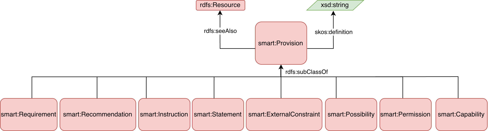
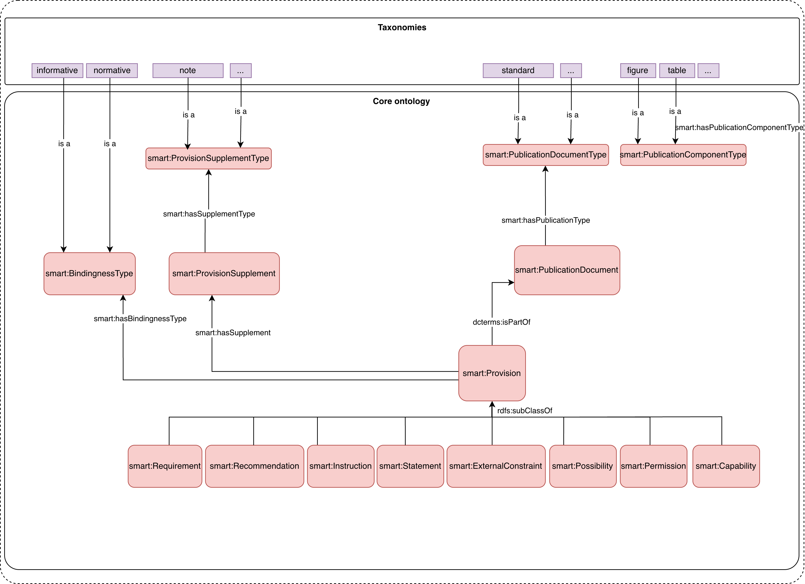
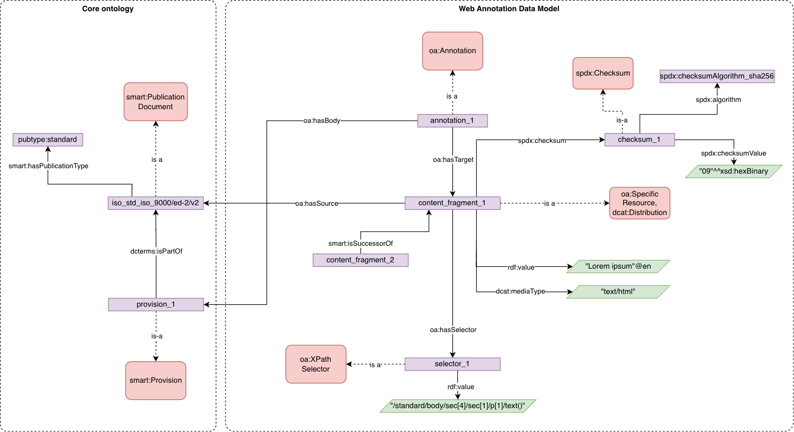
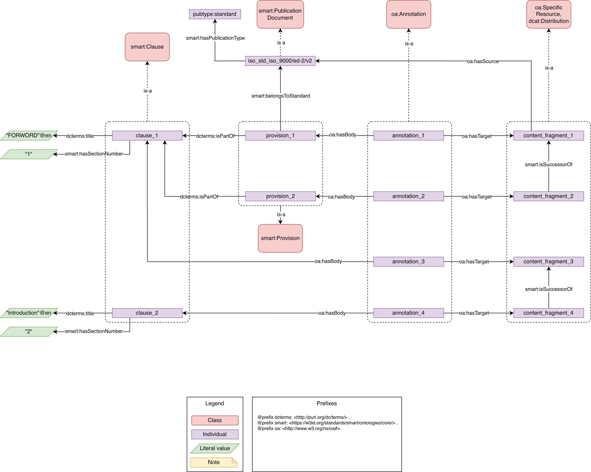
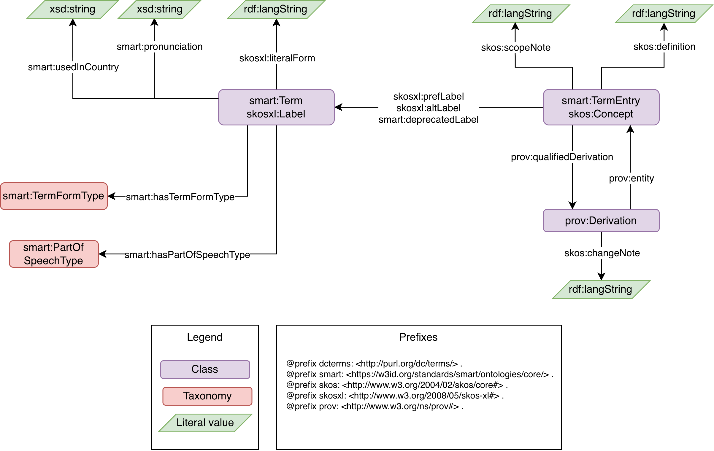

# Competency Questions

The requirements for the information model can be expressed as queries in natural language form called competency questions (CQ). 

Below are a subset of such competency questions.

??? info

    Examples used throughout these competency questions were randomly generated for documentation and test purpose.

## Provision

??? note "What are the types of Provision ? For each type, retrieve its defnition and related resources including its source from the ISO/IEC Directives part 2."
        
    === "Ontology Pattern"
        
    === "Example"
        
        The full [Provision type hierarchy](https://smartsdu.bitbucket.io/docs/im/browse/smartProvision.html) is defined in the Core Ontology.

    === "Query"

        ``` SPARQL
        PREFIX rdf: <http://www.w3.org/1999/02/22-rdf-syntax-ns#>
        PREFIX smart: <https://w3id.org/standards/smart/ontologies/core/>
        PREFIX dcterms: <http://purl.org/dc/terms/>
        PREFIX ex: <https://example.org/>
        PREFIX oa: <http://www.w3.org/ns/oa#>
        PREFIX owl: <http://www.w3.org/2002/07/owl#>
        PREFIX spdx: <http://spdx.org/rdf/terms#> 

        SELECT ?provision_type ?provision_type_definition ?source_in_directive_part2
        WHERE {

            ?provision_type rdfs:subClassOf+ smart:Provision ;
                        skos:definition ?provision_type_definition ;
                        rdfs:seeAlso ?source_in_directive_part2 .
        } Group by ?provision_type 
        ```

        The results of the query looks like the following:

        ```
        provision_type,provision_type_definition,source_in_directive_part2
        https://w3id.org/standards/smart/ontologies/core/Capability,"Expression, in the content of a document, that conveys the ability, fitness, or quality necessary to do or achieve a specified thing",https://www.iec.ch/standards-development/isoiec-directives-part-2#article-header-id-13-20
        https://w3id.org/standards/smart/ontologies/core/ExternalConstraint,Constraint or obligation on the user of the document (e.g. laws of nature or particular conditions existing in some countries or regions) that is not stated as a provision of the document,https://www.iec.ch/standards-development/isoiec-directives-part-2#article-header-id-13-21
        https://w3id.org/standards/smart/ontologies/core/Instruction,Provision that conveys an action to be performed,https://www.iec.ch/standards-development/isoiec-directives-part-2#article-header-id-13-14
        https://w3id.org/standards/smart/ontologies/core/Permission,"Expression, in the content of a document, that conveys consent or liberty (or opportunity) to do something",https://www.iec.ch/standards-development/isoiec-directives-part-2#article-header-id-13-18
        https://w3id.org/standards/smart/ontologies/core/Possibility,"Expression, in the content of a document, that conveys expected or conceivable material, physical or causal outcome",https://www.iec.ch/standards-development/isoiec-directives-part-2#article-header-id-13-19
        https://w3id.org/standards/smart/ontologies/core/Recommendation,"Expression, in the content of a document, that conveys a suggested possible choice or course of action deemed to be particularly suitable without necessarily mentioning or excluding others",https://www.iec.ch/standards-development/isoiec-directives-part-2#article-header-id-13-17
        https://w3id.org/standards/smart/ontologies/core/Requirement,"Expression, in the content of a document, that conveys objectively verifiable criteria to be fulfilled and from which no deviation is permitted if conformance with the document is to be claimed",https://www.iec.ch/standards-development/isoiec-directives-part-2#article-header-id-13-16
        https://w3id.org/standards/smart/ontologies/core/Statement,"Expression, in the content of a document, that conveys information",https://www.iec.ch/standards-development/isoiec-directives-part-2#article-header-id-13-15


        ```

    === "Schemas"

        === "Turtle"

            <div style="max-height: 600px; overflow-y: auto;">
            ``` turtle
                @prefix rdf:     <http://www.w3.org/1999/02/22-rdf-syntax-ns#> .
                @prefix sh:      <http://www.w3.org/ns/shacl#> .
                @prefix xsd:     <http://www.w3.org/2001/XMLSchema#> .
                @prefix rdfs:    <http://www.w3.org/2000/01/rdf-schema#> .
                @prefix owl:     <http://www.w3.org/2002/07/owl#> .
                @prefix dcterms: <http://purl.org/dc/terms/> .
                @prefix smart:    <https://w3id.org/standards/smart/ontologies/core/> .
                @prefix saf:     <https://www.iso.org/sites/smart/ontologies/smart-addressing-framework#> .
                @prefix i:       <https://smart-demo.iso.org/data/rdf/entity/> .
                @prefix gramm:   <https://w3id.org/standards/smart/ontologies/gramm#> .  # Extraction of data from the grammatical structure of sentences.
                @prefix dcterms: <http://purl.org/dc/terms/> .
                @prefix dcat: <http://www.w3.org/ns/dcat#> .

                smart:ProvisionShape
                    a sh:NodeShape ;
                    sh:targetClass smart:Provision ;
                    sh:property [
                        sh:path dcterms:isPartOf ;
                        sh:nodeKind sh:IRI ;
                        sh:or (
                            [
                                sh:class smart:Clause ;
                                sh:node smart:ClauseShape ;
                            ]
                            [
                                sh:class smart:PublicationDocument ;
                                sh:node smart:PublicationDocumentShape ;
                            ]
                        ) ;
                    ] ;
                    sh:property [
                        sh:path dcat:distribution ;
                        sh:nodeKind sh:IRI ;
                        sh:class dcat:Distribution ;
                    ] ;
                .

                smart:ClauseShape
                a sh:NodeShape ;
                    sh:targetClass smart:Clause ;
                    sh:property [
                        sh:path smart:hasSectionNumber ;
                        sh:datatype xsd:string ;
                    ] ;
                    sh:property [
                        sh:path dcterms:title ;
                        sh:datatype rdf:langString ;
                    ] ;
                .

                smart:PublicationDocumentShape
                    a sh:NodeShape ;
                    sh:targetClass smart:PublicationDocument ;
                    sh:property [
                        sh:path dcterms:hasVersion ;
                        sh:nodeKind sh:IRI ;
                        sh:class smart:PublicationDocument ;
                    ] ;
                    sh:property [
                        sh:path dcterms:replaces ;
                        sh:nodeKind sh:IRI ;
                        sh:class smart:PublicationDocument ;
                        sh:maxCount 1;
                    ] ;
                    sh:property [
                        sh:path dcterms:issued ;
                        sh:datatype xsd:date ;
                    ] ;
                .

            ```
            </div>

??? note "What is the bindingness of a Provision, to which PublicationDocument does it belong, and which supplementary elements (notes, examples, figures, etc.) are associated with it?"

    This competency question asks for:

    * a Provision's bindingness type,
    * the PublicationDocument with a defined publication type the Provision is part of, and
    * associated Provision Supplements classified by types.

    === "Ontology Pattern"

        

    === "Example"

        === "Turtle"

            ```turtle
            --8<--
                tests/annotation_model_test/annotations_sample.ttl
            --8<--
            ```

       
    === "Query"

        ```sparql
        PREFIX smart: <https://w3id.org/standards/smart/ontologies/core/>
        PREFIX dcterms: <http://purl.org/dc/terms/>
        PREFIX publication-type: <https://w3id.org/standards/smart/taxonomies/publication-type/> .
        PREFIX ex: <https://example.org/>
        
        SELECT ?provision ?bindingness_type ?publication ?publication_type ?supplement ?supplementType
        WHERE {

            VALUES ?provision { ex:provision_42 }

            ?provision a smart:Provision ;
                       smart:hasBindingnessType ?bindingness_type ;
                       dcterms:isPartOf ?publication .
            
            ?publication smart:hasPublicationType ?publication_type.

            OPTIONAL {
                ?provision smart:hasSupplement ?supplement .
                ?supplement smart:hasSupplementType ?supplementType .
            }
        }
        ```

    === "Schemas"

        === "Turtle"

            ```turtle
            @prefix sh:      <http://www.w3.org/ns/shacl#> .
            @prefix smart:    <https://w3id.org/standards/smart/ontologies/core/> .
            @prefix rdf:     <http://www.w3.org/1999/02/22-rdf-syntax-ns#> .
            @prefix dcterms: <http://purl.org/dc/terms/> .

            smart:ProvisionShape
                a sh:NodeShape ;
                sh:targetClass smart:Provision ;

                sh:property [
                    sh:path dcterms:isPartOf ;
                    sh:class smart:PublicationDocument ;
                    sh:nodeKind sh:IRI ;
                    sh:minCount 1 ;
                    sh:maxCount 1 ;
                ] ;

                sh:property [
                    sh:path smart:hasBindingnessType ;
                    sh:nodeKind sh:IRI ;
                    sh:minCount 1 ;
                    sh:maxCount 1 ;
                ] ;

                sh:property [
                    sh:path smart:hasStatement ;
                    sh:datatype rdf:langString ;
                    sh:minCount 1 ;
                ] ;

                sh:property [
                    sh:path smart:hasSupplement ;
                    sh:class smart:ProvisionSupplement ;
                    sh:nodeKind sh:IRI ;
                    sh:minCount 0 ;
                ] .
            ```


??? note "From which identified fragment in the authoritative file is the Provision derived? Is the extracted content within the core ontology congruous with the original?"
    
    A Standard in an NISO STS XML format is considered an authoritative file.
    
    === "Ontology Pattern"

        
    === "Example"
        
        === "Turtle"

            ``` turtle
                --8<--
                tests/annotation_model_test/annotations_sample.ttl
                --8<--
            ```

    === "Query"

        ``` SPARQL
        --8<--
        tests/annotation_model_test/cq_query.sparql
        --8<--

        ```

    === "Schemas"

        === "Turtle"

            ``` turtle
                --8<--
                information_model/schemas/shacl/annotation-ontology.shacl.ttl
                --8<--

            ```


??? note "How do I reconstruct a a readable document from its information model entities?"
    
    In order to rebuild a document's structure using the information model entities, the user needs to go through the annotations of clauses and provisions.
    The logical order of the annotated resources (`oa:SpecificResource`, `dcat:Distribution`) is denoted with relationship `smart:isSuccessorOf` .

    Since SPARQL cannot return results in a tree structure, one would need to use Python (or other scripting language) to rebuild the document structure as a tree. An example of such a script is provided here.
    
    
    === "Ontology Pattern"

        

    === "Example"
        
        === "Turtle"
            <div style="max-height: 600px; overflow-y: auto;">
            ``` turtle
                --8<--
                tests/document_reconstruction_test/document_sample.ttl
                --8<--

            ```
            </div>
        

    === "Query"
        <div style="max-height: 600px; overflow-y: auto;">
        ``` SPARQL
        --8<--
        tests/document_reconstruction_test/cq_query.sparql
        --8<--
        ```
        </div>

    === "Python"
        <div style="max-height: 600px; overflow-y: auto;">
        ``` python
        --8<--
        tests/document_reconstruction_test/reconstruct_document_sample_code.py
        --8<--
        ```
        </div>

        The results printed by this script look like the following:

        ```
        ex:document_1 [smart:PublicationDocument, "Sample publication document"]
            |-- ex:forword [smart:Clause, "FORWORD"]
            |   |-- ex:prov1 [smart:Provision, "Lorem ipsum dolor sit amet, consectetur adipiscing elit."]
            |   `-- ex:prov2 [smart:Provision, "Lorem ipsum dolor sit amet, consectetur adipiscing elit."]
            |-- ex:introduction [smart:Clause, "INTRODUCTION"]
            |   |-- ex:prov3 [smart:Requirement, "Lorem ipsum dolor sit amet, consectetur adipiscing elit."]
            |   `-- ex:prov4 [smart:Provision, "Lorem ipsum dolor sit amet, consectetur adipiscing elit."]
            `-- ex:technical_specification [smart:Clause, "Technical Specification"]
                |-- ex:prov5 [smart:Requirement, "Lorem ipsum dolor sit amet, consectetur adipiscing elit."]
                `-- ex:technical_detail [smart:Clause, "Technical Detail"]
                    |-- ex:prov6 [smart:Requirement, "Lorem ipsum dolor sit amet, consectetur adipiscing elit."]
                    |-- ex:prov7 [smart:Requirement, "Lorem ipsum dolor sit amet, consectetur adipiscing elit."]
                    `-- ex:prov8 [smart:Requirement, "Lorem ipsum dolor sit amet, consectetur adipiscing elit."]
        ```

    === "Schemas"

        === "Turtle"
            <div style="max-height: 600px; overflow-y: auto;">
            ``` turtle
                @prefix rdf:     <http://www.w3.org/1999/02/22-rdf-syntax-ns#> .
                @prefix sh:      <http://www.w3.org/ns/shacl#> .
                @prefix xsd:     <http://www.w3.org/2001/XMLSchema#> .
                @prefix rdfs:    <http://www.w3.org/2000/01/rdf-schema#> .
                @prefix owl:     <http://www.w3.org/2002/07/owl#> .
                @prefix dcterms: <http://purl.org/dc/terms/> .
                @prefix smart:    <https://w3id.org/standards/smart/ontologies/core/> .
                @prefix saf:     <https://www.iso.org/sites/smart/ontologies/smart-addressing-framework#> .
                @prefix i:       <https://smart-demo.iso.org/data/rdf/entity/> .
                @prefix gramm:   <https://w3id.org/standards/smart/ontologies/gramm#> .  # Extraction of data from the grammatical structure of sentences.
                @prefix dcterms: <http://purl.org/dc/terms/> .
                @prefix dcat: <http://www.w3.org/ns/dcat#> .

                smart:ProvisionShape
                    a sh:NodeShape ;
                    sh:targetClass smart:Provision ;
                    sh:property [
                        sh:path dcterms:isPartOf ;
                        sh:nodeKind sh:IRI ;
                        sh:or (
                            [
                                sh:class smart:Clause ;
                                sh:node smart:ClauseShape ;
                            ]
                            [
                                sh:class smart:PublicationDocument ;
                                sh:node smart:PublicationDocumentShape ;
                            ]
                        ) ;
                    ] ;
                    sh:property [
                        sh:path dcat:distribution ;
                        sh:nodeKind sh:IRI ;
                        sh:class dcat:Distribution ;
                    ] ;
                .

                smart:ClauseShape
                a sh:NodeShape ;
                    sh:targetClass smart:Clause ;
                    sh:property [
                        sh:path smart:hasSectionNumber ;
                        sh:datatype xsd:string ;
                    ] ;
                    sh:property [
                        sh:path dcterms:title ;
                        sh:datatype rdf:langString ;
                    ] ;
                .

                smart:PublicationDocumentShape
                    a sh:NodeShape ;
                    sh:targetClass smart:PublicationDocument ;
                    sh:property [
                        sh:path dcterms:hasVersion ;
                        sh:nodeKind sh:IRI ;
                        sh:class smart:PublicationDocument ;
                    ] ;
                    sh:property [
                        sh:path dcterms:replaces ;
                        sh:nodeKind sh:IRI ;
                        sh:class smart:PublicationDocument ;
                        sh:maxCount 1;
                    ] ;
                    sh:property [
                        sh:path dcterms:issued ;
                        sh:datatype xsd:date ;
                    ] ;
                .

            ```
            </div>
        


## Terms Definition

??? note "How do I refer to technical concept X in language Y?"
    
    Terms from standards are captured as `smart:TermEntry` entities, which associate with one or more `smart:Term` entities. The language tags of the `smart:Term` literal form can be used to denote the language of a term.

    Language tags used in this model conform to BCP 47 ([IETF Best Current Practice 47](https://www.rfc-editor.org/info/bcp47)), as defined in [RFC 5646](https://www.rfc-editor.org/rfc/rfc5646), in accordance with the RDF standard, which specifies the use of BCP 47 for language-tagged strings.

    
    
    === "Ontology Pattern"

        
    === "Example"
        
        === "Turtle"

            ``` turtle
                --8<--
                tests/terms_test/terms_sample.ttl
                --8<--
            ```

    === "Query"

        ``` SPARQL
            --8<--
            tests/terms_test/cq_query.sparql
            --8<--
        ```

    === "Schemas"

        === "Turtle"

            ``` turtle
                --8<--
                information_model/schemas/shacl/terminology-model.shacl.ttl
                --8<--
                

            ```

